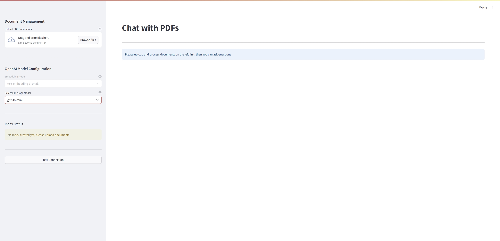
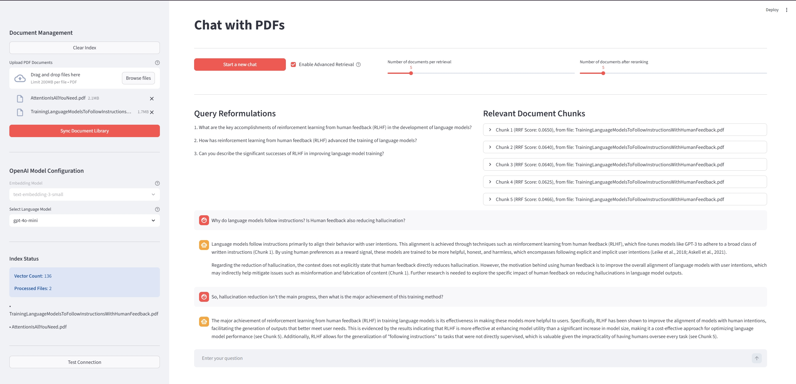

# chat-pdf
An AI-powered document assistant that enables users to upload PDF files and ask questions. It uses Retrieval-Augmented Generation (RAG) to provide precise answers backed by exact quotes and paragraphs from the source document.

## Demo

### Initial Interface


### Multi-turn Conversation


## Features

- **PDF Upload & Processing**: Upload and manage single or multiple PDF documents, with automatic parsing and indexing.
- **Document-Grounded Q&A**: Ask questions in natural language and receive answers based on the content of the uploaded documents.
- **Source Citations**: Answers include quoted text and paragraph-level references to the original documents.
- **Retrieval-Augmented Generation (RAG)**: Combines document retrieval with language model generation to provide context-aware responses.
- **Advanced Retrieval Techniques**: Applies query reformulation, query condensation, and reranking to improve retrieval relevance.

## Quick Start

### Prerequisites

- Python **3.13** (for local installation)
- Docker (for containerized deployment)
- All dependencies are listed in `requirements.txt`

### Option 1: Local Installation

1. Clone the repository:
```bash
git clone https://github.com/dahou-zheng/chat-pdf.git
cd chat-pdf
```

2. Install dependencies:
```bash
pip install -r requirements.txt
```

3. Set up environment variables:
Create a `.env` file in the root directory and add your API keys:
```env
OPENAI_API_KEY=your_openai_api_key_here
# Add other required API keys as needed
```

4. Run the application:
```bash
streamlit run app.py
```

5. Open your browser and navigate to:
```
http://localhost:8501
```

### Option 2: Docker Installation

1. Clone the repository:
```bash
git clone https://github.com/dahou-zheng/chat-pdf.git
cd chat-pdf
```

2. Build the Docker image:
```bash
docker build -t chat-pdf-rag:python-3.13 .
```

3. Run the container:
```bash
# On Linux/Mac
docker run -d -p 8501:8501 -v "$(pwd)/data:/app/data" --name chat-pdf chat-pdf-rag:python-3.13

# On Windows (PowerShell)
docker run -d -p 8501:8501 -v "${PWD}/data:/app/data" --name chat-pdf chat-pdf-rag:python-3.13
```

4. Open your browser and navigate to:
```
http://localhost:8501
```

5. To stop the container:
```bash
docker stop chat-pdf
```

6. To restart the container:
```bash
docker start chat-pdf
```

7. To view logs:
```bash
docker logs chat-pdf
```

## Technology Stack

### Frontend
- **UI Framework**: Streamlit (interactive web interface, file upload, chat-like Q&A experience)

### Backend / Core Logic
- **Orchestration**: LangChain
- **LLM**: OpenAI GPT models
- **Embeddings**: OpenAI Embeddings
- **Vector Store**: FAISS (local in-memory / persistent index)
- **PDF Processing**: PyMuPDF (fitz) for extraction and text parsing
- **Language & Runtime**: Python 3.13

### Deployment
- **Containerization**: Docker

## Project Structure
```
chat-pdf/
├── app.py                    # Streamlit entry point (frontend UI)
├── Dockerfile                # Docker container configuration
├── .dockerignore             # Docker build exclusions
├── requirements.txt          # Python dependency list
├── .gitignore                # Git ignore configuration
├── data/                     # Persistent data storage
│   ├── test_data/            # Sample PDFs for development and testing
│   └── vector_store/         # FAISS index files and custom metadata
├── images/                   # Screenshots and documentation images
│   ├── chat-pdf_initial_front_page_screenshot.jpg
│   └── chat-pdf_multi_turn_chat_screenshot.jpg
├── src/                      # Application source code
│   ├── __init__.py
│   ├── app_logic.py          # Core application workflow and orchestration
│   ├── config.py             # Global configuration and constants
│   ├── document_processor.py # PDF loading, parsing, and chunking
│   ├── embedding.py          # Text embedding generation
│   ├── generator.py          # LLM-based generation tasks (e.g. Q&A, reformulation, condensation, reranking)
│   └── vector_store.py       # Vector index creation, loading, and metadata management
└── README.md                 # Project documentation
```

